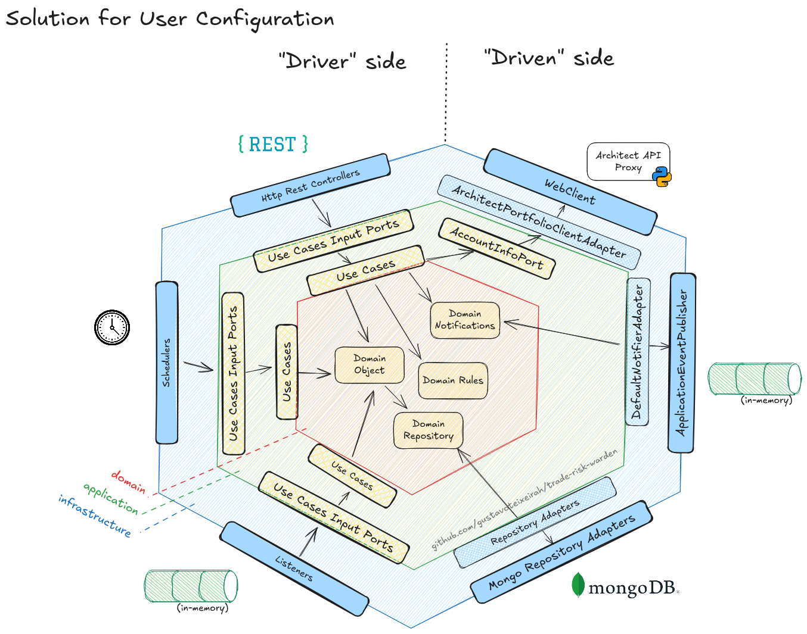

# Trade Risk Warden (TRW)

A service application to monitor trading account risk, evaluate daily/max limit breaches, and apply protective actions (for example, flattenAll) when needed. The project follows a Hexagonal Architecture (ports & adapters) and is organized into three modules: `domain`, `application`, and `infrastructure`.

## Documentation

- User configuration: `docs/1_user_configuration.md`
- Monitoring: `docs/2_monitoring.md`
- Risk checks: `docs/3_risk_checks.md`
- Actions on breach: `docs/4_actions_on_breach.md`

## How to run

Prerequisites:
- Java 21+
- MongoDB reachable at `mongodb://localhost:27017/trw` (or configure `spring.data.mongodb.uri`)
- Architect Proxy API (see dependency below) running

Steps:
1) Build the project:
   ```bash
   ./gradlew assemble
   ```
2) Start the service (infrastructure module):
   ```bash
   ./gradlew :infrastructure:bootRun
   ```
3) Relevant settings (`infrastructure/src/main/resources/application.yaml`):
   - `spring.jackson.time-zone`: timezone for timestamps
   - `spring.data.mongodb.uri`: MongoDB connection
   - `architect.baseUrl`: base URL of the Architect Proxy API (e.g., `http://localhost:8000`)

## Dependency: Architect Proxy API

This application depends on the external Architect Proxy API to execute trading actions (e.g., `flattenAll`). Repository:

- GitHub: [gustavoteixeirah/architect-proxy-api](https://github.com/gustavoteixeirah/architect-proxy-api)

Make sure the service is running and accessible at the URL configured in `architect.baseUrl`.

## Architecture (Hexagonal)

This application is designed following the Hexagonal Architecture. Replace the placeholder below with an image of the hexagon showing the Driver (primary) and Driven (secondary) sides and the main ports/adapters.



- Driver side (Primary): REST listeners, event listeners
- Driven side (Secondary): MongoDB repository, Architect Proxy client
- Ports (Domain): `TradingPort`, `UserAccountRepository`, etc.

## License

This project does not define an explicit license.
