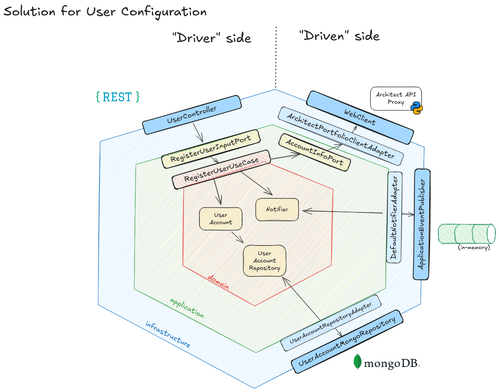

# User Configuration

Objective:

Register User Account Configuration

Input payload:

```json
{
    "clientId": "user123",
    "apiKey": "k",
    "apiSecret": "s",
    "maxRisk": { "type": "PERCENTAGE", "value": 30 },
    "dailyRisk": { "type": "ABSOLUTE", "value": 5000 },
    "currency": "USD"
}
```

After the user registration, we need to fetch the initial balance via the Architect API. However, their API does not provide a REST or Websocket interface. Only SKDs for Python and Rust.

Therefore, I've implemented a simple proxy application in python using their SDK, based on the provided python code, that exposes and endpoint to fetch account information:

```bash
curl --location 'http://localhost:8000/initial-balance' \
--header 'api_key: <api_key>' \
--header 'api_secret: <api_secret>'
```

Response example from their SDK, serialized to JSON:
```json
{
    "account": "9751e779-6637-486b-bfbc-fb2b64fb4702",
    "balances": {
        "USD": 100000.0
    },
    "cash_excess": 76551.0,
    "equity": 100000.0,
    "position_margin": 23449.0,
    "positions": {
        "ES 20250919 CME Future/USD": [
            {
                "break_even_price": null,
                "cost_basis": 6588.0,
                "liquidation_price": null,
                "quantity": 1.0,
                "trade_time": "2025-09-12T20:23:41.964442+00:00",
                "unrealized_pnl": null
            }
        ]
    },
    "purchasing_power": 76551.0,
    "realized_pnl": 0.0,
    "timestamp": "2025-09-12T20:23:41.964447+00:00",
    "total_margin": 23449.0,
    "unrealized_pnl": null,
    "yesterday_equity": null
}
```

With the Architect API dependency solved, I've proceed to designing the solution for this first flow. Below is an image I've made in Excalidraw, 
to illustrate the parts involved in the solution.



The explanation here is:

1. A user is going to register through the UserController (Driver side, requires a User to start the flow).
2. The controller will create an Input Command (just a DTO) to call the RegisterUser use case, which will orchestrate the user creation flow.
3. It will need to also fetch the initial balance of the user. For that, it uses the AccountInfoPort, which is implemented by an REST adapter to call the Architect Python Proxy API.
4. With the user information and account balance information in hands, it calls the repository to persist the data.
5. After that, it sends an event to the Notifier.

For the notification system, I've choose to use the [Spring Application Event Publisher](https://docs.spring.io/spring-framework/docs/current/javadoc-api/org/springframework/context/ApplicationEventPublisher.html)

It's a nice way to uncouple the responsibilities of handling events from the domain, to the application/infrastructure.

The idea here is that we'll have something like an in-memory queue that Spring will handle. It will publish our event to it, and we'll
have as many listeners as we want for those event. I've added a logging event listener as example. I'll add the Slack one later.
And the nice thing is that this event publisher works as a fan-out publisher, so we can have multiple listeners for the same event.


---


