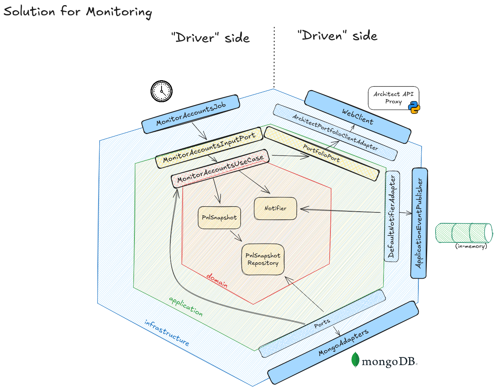

# Monitoring

Let me walk you through how monitoring works.

For this, I chose to create a small job that runs every 10 seconds. Each tick, it goes over the registered users, calls
the Architect proxy API to get the current account summary, and also loads the last snapshot we stored for that user. If
nothing changed, we simply don’t persist a new snapshot. If anything changed (equity or PnL), we save a fresh record.

How it works, step by step:

1) The scheduler is triggered every 10 seconds.
2) The job invokes the Monitor Accounts use case.
3) The use case fetches, for each user:
    - Credentials + last snapshot.
    - The account summary from Architect Python Proxy API.
4) The summary is mapped to `PnlSnapshot`:
    - `currentBalance` = equity
    - `realizedPnlToday` = realized_pnl
    - `cumulativePnl` = realized_pnl + max(0, unrealized_pnl)
5) Before saving, we compare with the last snapshot. If it is equal, we skip persistence.
6) When it changes, we save to Mongo (`pnl_snapshots`, indexed by `clientId` and `ts`).

