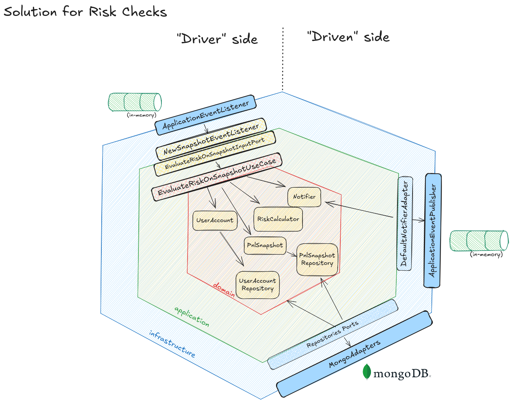

# Risk Checks

Objective:

Continuously evaluate account snapshots against configured risk limits and emit decisions when limits are breached.

What it does:

- On every monitoring tick, the latest snapshot for each user is evaluated against their limits.
- If a limit is reached or exceeded, a decision is produced to inform downstream actions (e.g., alerts, blocks).

How it works, step by step:

1) The calculator receives two inputs: the user’s configuration (including limits and initial balance) and the latest snapshot (equity and PnL).
2) It runs a sequence of independent checks, each responsible for a specific constraint (e.g., daily loss, total loss).
3) Checks are executed in a known priority order (lower number = higher priority).
4) The first check that detects a breach returns a decision, and the evaluation stops there (short‑circuit).
5) If no check triggers, the result is “no decision”.

Decisions:

- The decision communicates:
  - the type of breach (e.g., daily vs. maximum),
  - the computed loss amount,
  - the applicable limit amount.
- Amounts are currency‑aware and scale‑safe.

Thresholds and units:

- Limits can be absolute amounts or percentages.
- Percentage limits are computed using the user’s initial balance; absolute limits are taken as‑is.
- This keeps the logic explicit and avoids accidental unit mismatches.

Design patterns applied:

- Strategy: each risk rule is a self‑contained strategy that knows how to evaluate one constraint.
- Chain of Responsibility: strategies are ordered and evaluated in sequence; processing stops at the first breach.
- Value Objects: money and thresholds are modeled as immutable values to ensure correctness (currency, scale, units).

Why this design:

- Separation of concerns: each rule is small, isolated, and easy to reason about.
- Testability: rules can be tested independently with focused unit tests.
- Extensibility: adding a new rule does not require changing existing ones.

How to add a new check:

1) Define the new rule’s evaluation criteria (what inputs it needs and what constitutes a breach).
2) Implement it as a standalone strategy that returns either “breach decision” or “no decision”.
3) Assign a priority so it runs in the intended order relative to the others.
4) Register it with the calculator (it will be automatically sorted and evaluated).

Operational notes:

- Because evaluation short‑circuits, place the most critical rules with higher priority.
- Use unit tests to validate edge cases (zero/negative values, currency differences, scale handling).
- Decisions can be consumed by different drivers (logging, notifications, automated actions) without coupling the rules to those concerns.

